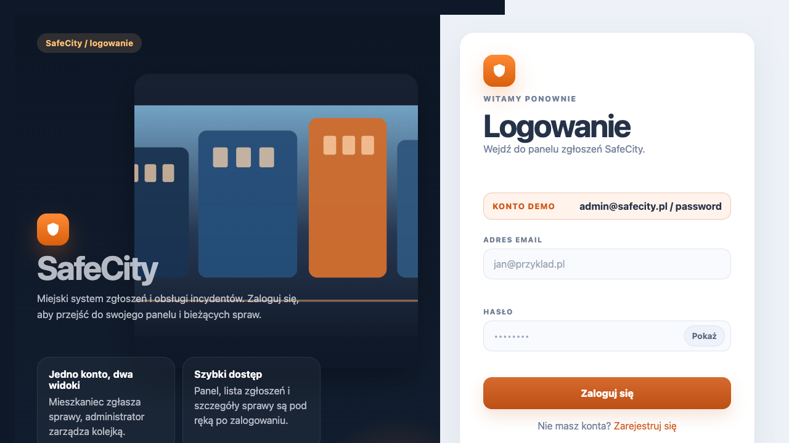
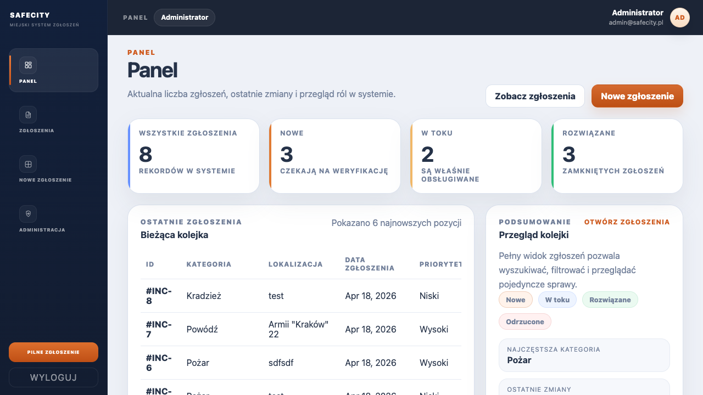
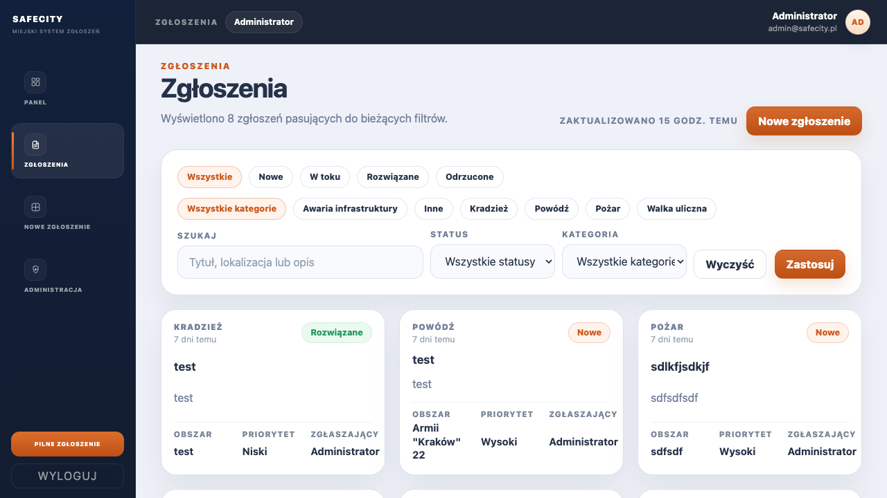
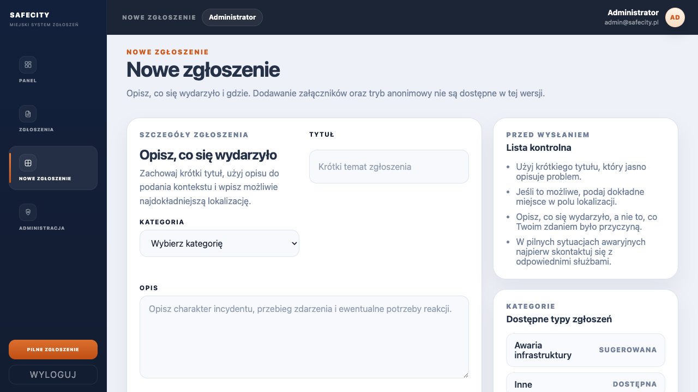
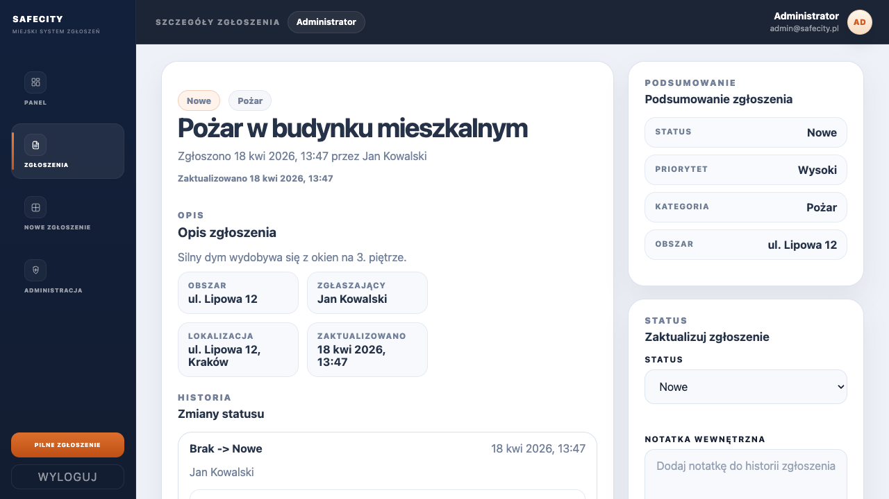
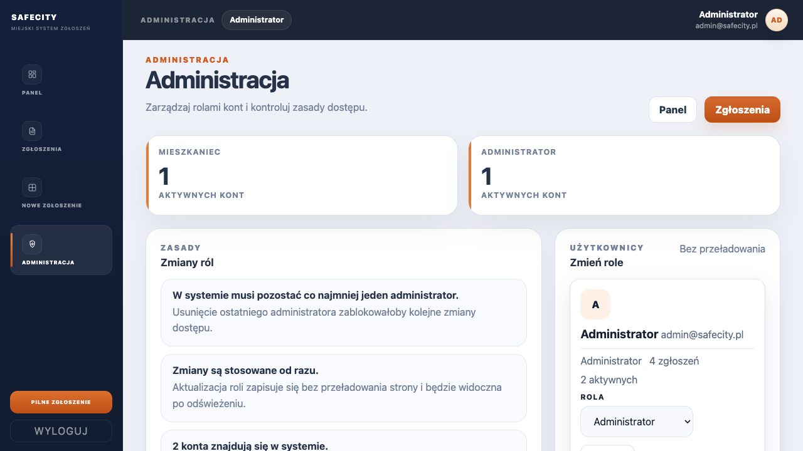

# SafeCity

SafeCity to aplikacja PHP do zgłaszania i obsługi incydentów miejskich. Projekt łączy backend w architekturze MVC, frontend renderowany po stronie klienta z użyciem JavaScript oraz bazę PostgreSQL uruchamianą w Dockerze.

## Cel projektu

Aplikacja realizuje temat miejskiego systemu zgłoszeń:

- mieszkaniec może się zarejestrować, zalogować i dodać zgłoszenie,
- administrator może przeglądać wszystkie sprawy, zmieniać ich status oraz zarządzać rolami użytkowników,
- system przechowuje historię zmian statusów i podstawowe statystyki do panelu.

## Stack technologiczny

- `PHP 8` - backend, routing, kontrolery, logika sesji i autoryzacji
- `PostgreSQL` - baza danych
- `JavaScript` - warstwa SPA dla panelu aplikacji
- `Fetch API` - komunikacja AJAX z endpointami `/api/...`
- `HTML + CSS` - widoki logowania/rejestracji oraz layout aplikacji
- `Docker Compose` - uruchamianie środowiska lokalnego
- `Nginx` - serwer HTTP dla aplikacji

## Architektura aplikacji

Projekt jest zbudowany w modelu MVC z rozdzieleniem odpowiedzialności:

- `Routing.php` - rejestracja i obsługa tras HTTP
- `src/controllers/` - kontrolery aplikacji, autoryzacja, odpowiedzi JSON i renderowanie widoków
- `src/repository/` - warstwa dostępu do danych oparta o PDO
- `public/views/` - widoki HTML dla logowania, rejestracji i stron statusowych
- `public/js/` - frontend panelu użytkownika i logiki AJAX
- `docker/db/init/init.sql` - schemat, dane startowe, widoki, funkcje i trigger

Przepływ danych wygląda następująco:

`przeglądarka -> Routing -> Controller -> Repository -> PostgreSQL`

Frontend po zalogowaniu działa jako prosty panel SPA:

- `public/js/auth.js` obsługuje logowanie i rejestrację przez `fetch`,
- `public/js/app.js` renderuje ekran panelu, listę zgłoszeń, formularz, szczegóły i administrację,
- backend zwraca dane JSON z endpointów `/api/auth/*`, `/api/incidents/*`, `/api/dashboard/stats`, `/api/admin/users`.

## Role użytkowników

W systemie są co najmniej dwie role:

- `citizen` - mieszkaniec
- `admin` - administrator

Uprawnienia są egzekwowane po stronie backendu przez sesję użytkownika i kontrolę roli. Projekt zawiera:

- logowanie,
- rejestrację,
- wylogowanie,
- sesję użytkownika,
- CSRF token,
- walidację danych,
- haszowanie haseł.

## Funkcje aplikacji

- logowanie, rejestracja i wylogowanie,
- dashboard z podsumowaniem zgłoszeń,
- lista zgłoszeń z filtrami,
- tworzenie nowego zgłoszenia,
- widok szczegółów zgłoszenia,
- historia zmian statusów,
- zmiana statusu sprawy przez administratora,
- panel administracyjny do zarządzania rolami użytkowników.

## Flow aplikacji

### 1. Wejście do systemu

Użytkownik trafia na ekran logowania albo rejestracji. Formularze są wysyłane asynchronicznie przez `Fetch API`, a po poprawnym logowaniu tworzona jest sesja.

### 2. Panel główny

Po zalogowaniu użytkownik trafia do panelu z podsumowaniem systemu: liczba zgłoszeń, ostatnie wpisy, aktywność i rozkład kategorii.

### 3. Lista zgłoszeń

Użytkownik może przejść do listy zgłoszeń, filtrować rekordy po statusie i kategorii oraz wyszukiwać po treści.

### 4. Dodanie nowego zgłoszenia

Formularz nowego zgłoszenia zapisuje dane incydentu do bazy. Nowy rekord otrzymuje status początkowy i wpis w historii statusów.

### 5. Szczegóły sprawy

Na ekranie szczegółów widać opis, lokalizację, zgłaszającego, historię zmian oraz podsumowanie zgłoszenia. Administrator może zmienić status i dodać notatkę.

### 6. Administracja

Administrator ma dostęp do panelu zarządzania użytkownikami i może zmieniać role bez przeładowania strony.

## Zrzuty ekranu

### Ekran logowania



### Panel główny



### Lista zgłoszeń



### Formularz nowego zgłoszenia



### Szczegóły zgłoszenia



### Panel administracyjny



## Uruchomienie przez Docker

Wymagania:

- Docker Desktop lub Docker Engine
- Docker Compose v2

Uruchomienie:

```bash
docker compose up --build
```

Adresy po starcie:

- aplikacja: `http://localhost:8080`
- pgAdmin: `http://localhost:5050`
- PostgreSQL z hosta: `localhost:5433`

Reset danych:

```bash
docker compose down -v
docker compose up --build
```

## Dane testowe

### Konta użytkowników

| Rola | Email | Hasło |
|---|---|---|
| admin | `admin@safecity.pl` | `password` |
| citizen | `jan@safecity.pl` | `password` |

### pgAdmin

- email: `admin@example.com`
- hasło: `admin`

### Połączenie z PostgreSQL

| Parametr | Wartość |
|---|---|
| host z kontenerów | `db` |
| host z maszyny lokalnej | `localhost` |
| port z kontenerów | `5432` |
| port z hosta | `5433` |
| baza | `db` |
| user | `docker` |
| hasło | `docker` |

## Baza danych

Najważniejsze tabele:

- `roles`
- `users`
- `incident_statuses`
- `incident_categories`
- `incidents`
- `incident_comments`
- `incident_status_history`

Najważniejsze elementy SQL:

- widok `incidents_summary`
- widok `dashboard_stats`
- funkcja `update_timestamp()`
- funkcja `user_incident_count(uid, target_month)`
- trigger `trg_incidents_updated`
- referencje z akcjami `RESTRICT`, `SET NULL`, `CASCADE`

Schemat bazy i relacje:

- ERD: [docs/erd.md](docs/erd.md)
- eksport / inicjalizacja SQL: [docker/db/init/init.sql](docker/db/init/init.sql)

## Struktura repozytorium

```text
.
├── Routing.php
├── docker/
│   ├── db/
│   ├── nginx/
│   └── php/
├── docs/
│   ├── erd.md
│   └── screenshots/
├── public/
│   ├── css/
│   ├── js/
│   └── views/
└── src/
    ├── controllers/
    ├── repository/
    └── utils/
```

## Podsumowanie wymagań

Projekt zawiera:

- dokumentację uruchomienia i działania systemu,
- screeny interfejsu,
- opis flow aplikacji,
- Docker,
- backend obiektowy w PHP,
- PostgreSQL,
- eksport bazy do `.sql`,
- ERD,
- sesję użytkownika, role i uprawnienia,
- AJAX przez `Fetch API`,
- widoki, funkcje, trigger i transakcje po stronie bazy / repozytorium.
