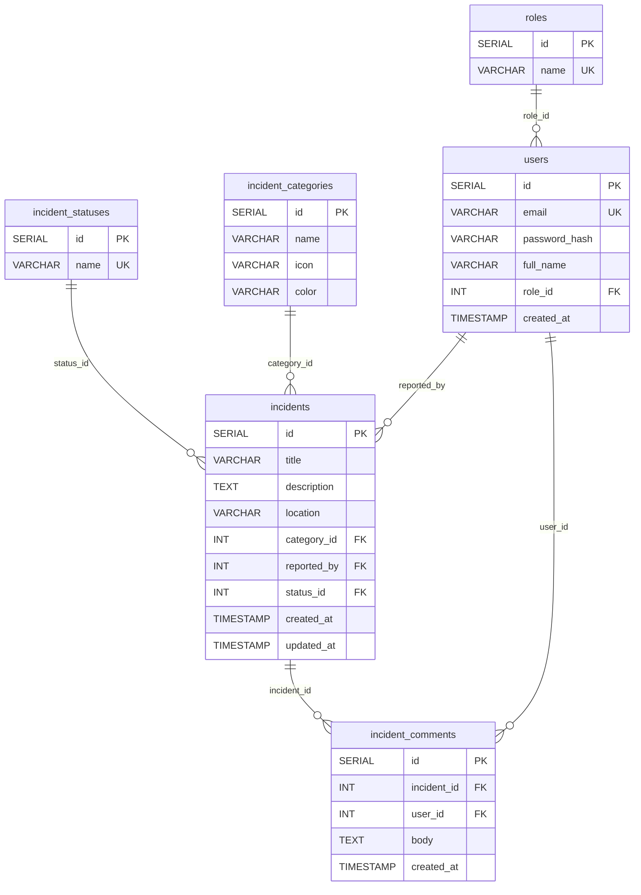

# SafeCity ERD

Diagram encji i relacji dla aktualnego schematu z `docker/db/init/init.sql`.

## Uwagi

- `category_id` i `reported_by` są nullable, bo mają `ON DELETE SET NULL`.
- `incident_comments.incident_id` ma `ON DELETE CASCADE`, więc usunięcie incydentu usuwa też komentarze.
- `role_id` i `status_id` mają `ON DELETE RESTRICT`, co blokuje usunięcie słownika używanego przez rekordy biznesowe.
